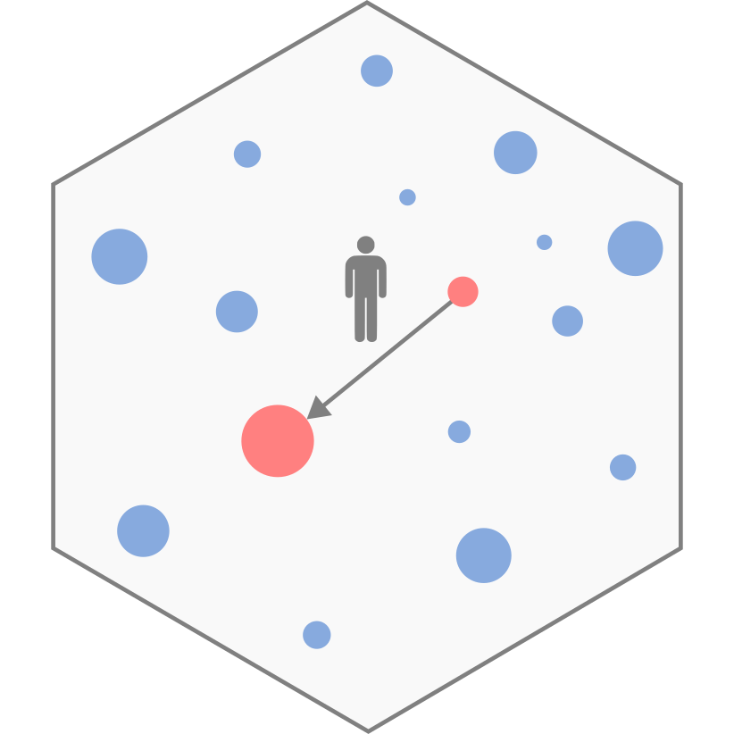

# __PyTDLM__ 

# Systematic comparison of trip distribution laws and models in Python

<!-- badges: start -->
[](https://github.com/RTDLM/PyTDLM/actions/workflows/test-builds.yml)
[](https://pypi.org/project/pytdlm)
[](https://pypistats.org/packages/pytdlm)
<!-- badges: end -->

## Description

A Python port of the [TDLM R package](https://github.com/RTDLM/TDLM), with 
numpy-based implementations and parallel processing support for multiple 
exponent values.

[PyTDLM](https://rtdlm.github.io/PyTDLM/) provides implementations of several 
trip distribution models commonly used in transportation planning and 
spatial analysis:

### Available laws
- **GravExp**: Gravity model with exponential distance decay
- **NGravExp**: Normalized gravity model with exponential decay
- **GravPow**: Gravity model with power distance decay
- **NGravPow**: Normalized gravity model with power decay
- **Schneider**: Schneider's intervening opportunities model
- **Rad**: Radiation model
- **RadExt**: Extended radiation model
- **Rand**: Random model (baseline)

### Available models
- **UM**: Unconstrained Model
- **PCM**: Production Constrained Model
- **ACM**: Attraction Constrained Model
- **DCM**: Doubly Constrained Model

## Installation

### Using conda
```bash
conda install -c conda-forge pytdlm
```

### Using pip
```bash
pip install PyTDLM
```

### From source
```bash
git clone https://github.com/PyTDLM/TDLM.git
cd PyTDLM
pip install -e .
```

## Quick start

```python
import numpy as np
from TDLM import tdlm

# Prepare your data
mi = np.array([100, 200, 150])  # Origin masses
mj = np.array([80, 180, 120])   # Destination masses  
dij = np.array([[0, 10, 15],    # Distance matrix
                [10, 0, 8], 
                [15, 8, 0]])
Oi = np.array([50, 80, 60])     # Out-trips
Dj = np.array([40, 90, 50])     # In-trips
Tij_observed = np.array([[0, 25, 25],  # Observed trip matrix
                         [30, 0, 50],
                         [35, 35, 0]])

# Run simulation
exponent = np.arange(0.1, 1.01, 0.01)
results = tdlm.run_law_model(
    law='NGravExp',
    mass_origin=mi,
    mass_destination=mj, 
    distance=dij,
    exponent=exponent,
    model='DCM',
    out_trips=Oi,
    in_trips=Dj,
    repli=100
)

# Calculate goodness-of-fit
gof_results = tdlm.gof(sim=results, obs=Tij_observed, distance=dij)

# Print results for a given exponent
print(gof_results[0.1].to_markdown(index=False))
```

## Documentation

For detailed documentation and examples, visit: 
[https://rtdlm.github.io/PyTDLM/](https://rtdlm.github.io/PyTDLM/)

## Citation

If you use this library in your research, please cite: [Reference to come].

```bibtex
@software{PyTDLM,
  author = {Perrier, R., Gargiulo, G., Jayet, C. and Lenormand, M.},
  title = {PyTDLM: Systematic comparison of trip distribution laws and models in Python},
  year = {2025},
  note = {Reference forthcoming}
}
```
