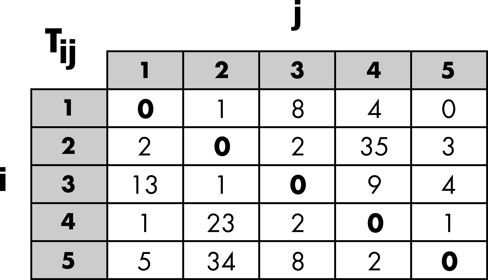
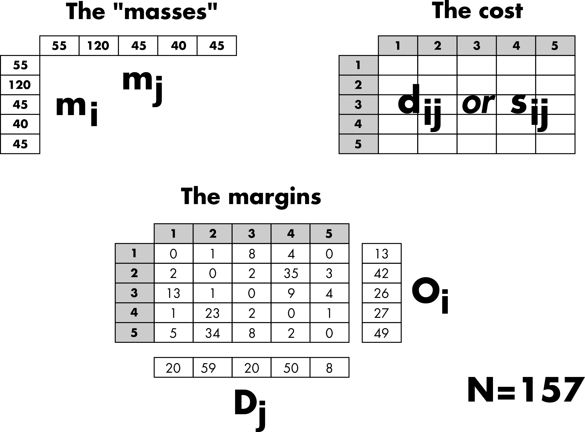
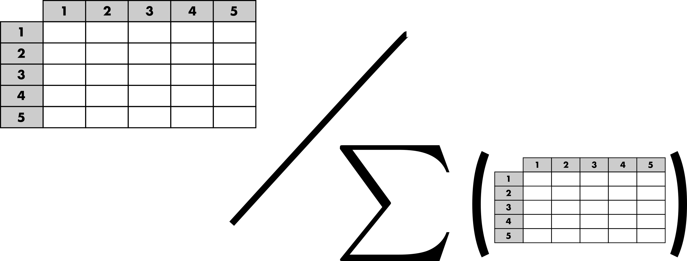
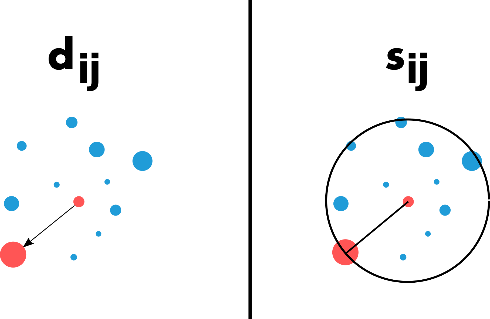
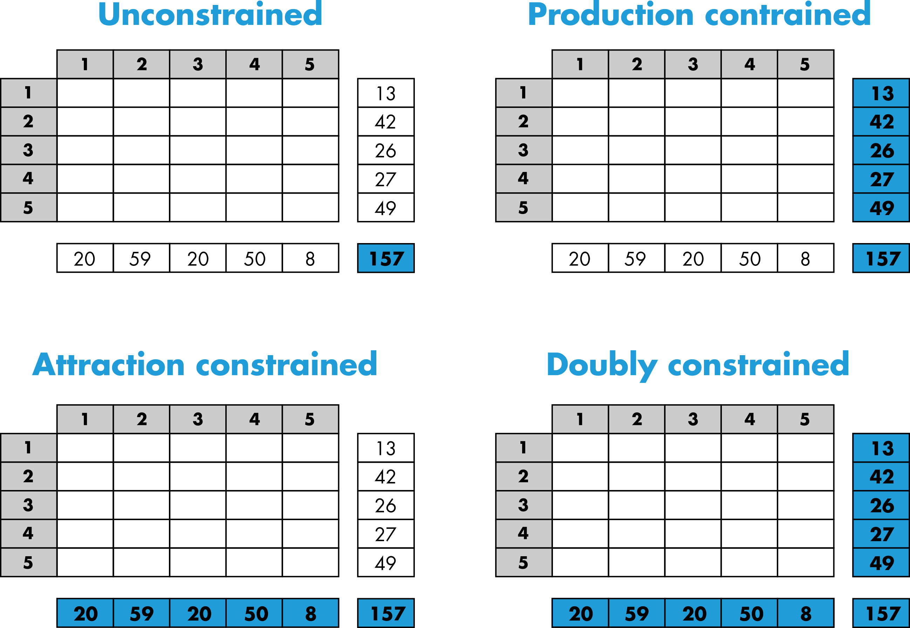
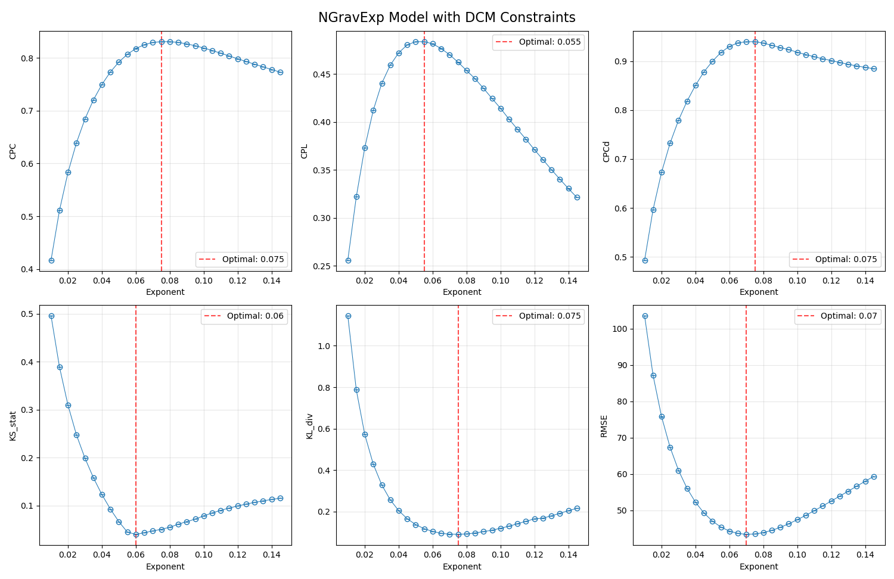

---
hide:
  - navigation
---

# Tutorial for PyTDLM

This tutorial is largely derived from the one of the [R package](https://rtdlm.github.io/TDLM/articles/TDLM.html).

## Introduction

This tutorial aims to describe the different features of the Python package `PyTDLM`.
The main purpose of the `PyTDLM` package is to provide a rigorous framework for 
fairly comparing trip distribution laws and models ([Lenormand *et al.* (2016)](https://doi.org/10.1016/j.jtrangeo.2015.12.008)). This 
general framework is based on a two-step approach for generating mobility flows 
by separating the trip distribution law, such as gravity or intervening 
opportunities, from the modeling approach used to generate flows from this law.

## A short note on terminology

This framework is part of the four-step travel model. It corresponds to the
second step, called trip distribution, which aims to match trip origins with
trip destinations. The model used to generate trips or flows, and more
generally the degree of interaction between locations, is often referred to as
a spatial interaction model. Depending on the research area, a matrix or a
network formalism may be used to describe these spatial interactions.
Origin-Destination matrices (or trip tables) are common in geography or
transportation, while in statistical physics or complex systems studies, the
term mobility networks is usually preferred.

## Origin–Destination matrix

The description of movements within a given area is represented by an
Origin-Destination (OD) matrix. The area of interest is divided into $`n`$
locations, and $`T_{ij}`$ represents the volume of flows between location $`i`$ and
location $`j`$. This volume typically corresponds to the number of trips or a
commuting flow (i.e., the number of individuals living in $`i`$ and working in
$`j`$). The OD matrix is square, contains only positive values, and may have a
zero diagonal (Figure 1).

<figure markdown="span">
  { : style="transform: scale(0.6);" }
  <figcaption>Figure 1: Schematic representation of an Origin-Destination matrix.</figcaption>
</figure>

## Aggregated inputs information

Three categories of inputs are typically considered to simulate an OD matrix
(Figure 2). The masses and distances are the primary ingredients used to
generate a matrix of probabilities based on a given distribution law. Thus, the
probability $`p_{ij}`$ of observing a trip from location $`i`$ to location $`j`$
depends on the masses, the demand at the origin ($`m_i`$), and the offer at
the destination ($`m_j`$). Typically, population is used as a surrogate for
demand and offer. The probability of movement also depends on the costs,
which are based on the distance $`d_{ij}`$ between locations or the number of
opportunities $`s_{ij}`$ between locations, depending on the chosen law (more
details are provided in the next ["Trip distribution laws" section](https://rtdlm.github.io/PyTDLM/tutorial/#trip-distribution-laws)). In general,
the effect of the cost can be adjusted with a parameter.

The margins are used to generate an OD matrix from the matrix of probabilities
while preserving the total number of trips ($`N`$), the number of outgoing trips
($`O_i`$), and/or the number of incoming trips ($`D_j`$) (more details are provided
in the ["Constrained distribution models" section](https://rtdlm.github.io/PyTDLM/tutorial/#constrained-distribution-models)).

<figure markdown="span">
  { : style="transform: scale(0.75);" }
  <figcaption>Figure 2: Schematic representation of the aggregated inputs information.</figcaption>
</figure>

## Trip distribution laws

The purpose of a trip distribution law is to estimate the probability $`p_{ij}`$
that, out of all the possible travels in the system, there is one between
location $`i`$ and location $`j`$. This probability is asymmetric in $`i`$ and $`j`$,
as are the flows themselves. It takes the form of a square matrix of probabilities.
This probability is normalized across all possible pairs of origins and
destinations, such that $`\sum_{i,j=1}^n p_{ij} = 1`$. Therefore, a matrix of
probabilities can be obtained by normalizing any OD matrix (Figure 3).

<figure markdown="span">
  { : style="transform: scale(0.60);" }
  <figcaption>Figure 3: Schematic representation of the matrix of probabilities.</figcaption>
</figure>

As mentioned in the previous section, most trip distribution laws depend
on the demand at the origin ($`m_i`$), the offer at the destination ($`m_j`$), and
a cost to move from $`i`$ to $`j`$. There are two major approaches for estimating
the probability matrix. The traditional gravity approach, in analogy with
Newton's law of gravitation, is based on the assumption that the amount of trips
between two locations is related to their populations and decays according to a
function of the distance $`d_{ij}`$ between locations. In contrast to the gravity
law, the laws of intervening opportunities hinge on the assumption that the
number of opportunities $`s_{ij}`$ between locations plays a more important role
than the distance ([Lenormand *et al.* (2016)](https://doi.org/10.1016/j.jtrangeo.2015.12.008)). This fundamental difference between the two
schools of thought is illustrated in Figure 4.

<figure markdown="span">
  { : style="transform: scale(0.50);" }
  <figcaption>Figure 4: Illustration of the fundamental difference between gravity and 
  intervening opportunity laws.</figcaption>
</figure>

It is important to note that the effect of the cost between locations (distance
or number of opportunities) can usually be adjusted with a parameter, which can
be calibrated automatically or by comparing the simulated matrix with observed
data.

## Constrained distribution models

The purpose of the trip distribution models is to generate an OD matrix 
$`\tilde{T}=(\tilde{T}_{ij})`$ by 
drawing at random $`N`$ trips from the trip distribution law 
$`(p_{ij})_{1 \leq i,j \leq n}`$ respecting different level of constraints 
according to the model. We considered four different types of models in this
package. As can be observed in Figure 5, the four models respect different level
of constraints from the total number of trips to the total number of out-going 
and in-coming trips by locations (i.e. the margins).

<figure markdown="span">
  { : style="transform: scale(0.80);" }
  <figcaption>Figure 5: Schematic representation of the constrained distribution models.</figcaption>
</figure>

More specifically, the volume of flows $`\tilde{T}_{ij}`$ is generated from the
matrix of probability with multinomial random draws that will take different 
forms according to the model used ([Lenormand *et al.* (2016)](https://doi.org/10.1016/j.jtrangeo.2015.12.008)). Therefore, since the process
is stochastic, each simulated matrix is unique and composed of integers. Note 
that it is also possible to generate an average matrix from the multinomial 
trials.

## Goodness-of-fit measures

Finally, the trip distribution laws can be calibrated, and both the trip 
distribution laws and models can be evaluated by comparing a simulated matrix 
$`\tilde{T}`$ with the observed matrix $`T`$. These comparisons rely on various 
goodness-of-fit measures, which may or may not account for the distance 
between locations. These measures are described above.

### Common Part of Commuters (CPC)

```math
CPC(T,\tilde{T}) = \frac{2\cdot\sum_{i,j=1}^n min(T_{ij},\tilde{T}_{ij})}{N + \tilde{N}}
```
[Gargiulo *et al.* (2012)](https://doi.org/10.18564/jasss.1964), [Lenormand *et al.* (2012)](https://doi.org/10.1371/journal.pone.0045985), [Lenormand *et al.* (2016)](https://doi.org/10.1016/j.jtrangeo.2015.12.008)

### Root Mean Square Error (RMSE)

```math
RMSE(T,\tilde{T}) = \sqrt{\frac{\sum_{i,j=1}^n (T_{ij}-\tilde{T}_{ij})^2}{N}}
```

### Kullback–Leibler divergence (KL)

```math
KL(T,\tilde{T}) = \sum_{i,j=1}^n \frac{T_{ij}}{N}\log\left(\frac{T_{ij}}{N}\frac{\tilde{N}}{\tilde{T}_{ij}}\right)
```
[Kullback & Leibler (1951)](http://www.jstor.org/stable/2236703)

### Common Part of Links (CPL) 

```math
CPL(T,\tilde{T}) = \frac{2\cdot\sum_{i,j=1}^n 1_{T_{ij}>0} \cdot 1_{\tilde{T}_{ij}>0}}{\sum_{i,j=1}^n 1_{T_{ij}>0} + \sum_{i,j=1}^n 1_{\tilde{T}_{ij}>0}}
```
[Lenormand *et al.* (2016)](https://doi.org/10.1016/j.jtrangeo.2015.12.008)

### Common Part of Commuters based on the disance (CPC_d)

Let us consider $`N_k`$ (and $`\tilde{N}_k`$) the sum of observed (and simulated) flows at a distance comprised
in the bin $`\left[\text{bin\_size} \cdot k-\text{bin\_size}, \text{bin\_size} \cdot k\right[`$.

```math
CPC_d(T,\tilde{T}) = \frac{2\cdot\sum_{k=1}^{\infty} min(N_{k},\tilde{N}_{k})}{N+\tilde{N}}
```
[Lenormand *et al.* (2016)](https://doi.org/10.1016/j.jtrangeo.2015.12.008)

### Kolmogorv-Smirnov statistic and p-value (KS). 

These measures, described in [Massey (1951)](https://doi.org/10.2307/2280095), are based on the observed and 
simulated flow distance distributions.
---

## Example of commuting in Kansas

### Data

In this example, also provided as the [`basic_usage.py` script](https://github.com/RTDLM/PyTDLM/blob/main/examples/basic_usage.py), we will use commuting data from US Kansas in 2000 to illustrate
the main functions of the package. The dataset comprises three tables providing 
information on commuting flows between the 105 US 
Kansas counties in 2000. 

The masses and margins are contained in the [`Inputs.csv` file](https://github.com/RTDLM/PyTDLM/blob/main/examples/data_US/Inputs.csv).
```python
import os
import gzip
import numpy as np
import pandas as pd
import matplotlib.pyplot as plt
from time import perf_counter
from datetime import timedelta
from TDLM import tdlm

data_path = os.getcwd() + os.sep + "data_US" + os.sep

# Sample data - replace with your actual data
print("Setting up example data...")

#Inputs (mi, mj, Oi and Dj)
inputs = pd.read_csv(data_path + "Inputs.csv", sep=";")

# Origin and destination masses (population, employment, etc.)
mi = inputs.iloc[:, 0].values  # Number of inhabitants at origin (mi)
mj = inputs.iloc[:, 1].values  # Number of inhabitants at destination (mj)

# Trip constraints (for constrained models)
Oi = inputs.iloc[:, 2].values.astype(int)  # Number of out-commuters (Oi)
Dj = inputs.iloc[:, 3].values.astype(int)  # Number of in-commuters (Dj)
```

The [distance matrix](https://github.com/RTDLM/PyTDLM/blob/main/examples/data_US/Distance.csv.gz) is zero-diagonal square matrix of floats. Each element of the matrix represents the distance in kilometers between a pair of US Kansas counties.

```python
# Distance matrix dij (size n x n)
# Locale detection (whether decimal place is marked by "." or ",")
decimal = '.'
with gzip.open(data_path + "Distance.csv.gz", 'rt') as f:
    _ = f.readline() #discard header
    for line in f:
        if ',' in line:
            decimal = ','
            break
        
dij = pd.read_csv(data_path + "Distance.csv.gz", compression='gzip', sep=";", decimal=decimal, header=0)
dij = dij.values.astype(float)
```

The observed [OD matrix](https://github.com/RTDLM/PyTDLM/blob/main/examples/data_US/OD.csv) is a zero-diagonal square 
matrix of integers. Each element of the matrix represents the number of 
commuters between a pair of US Kansas counties.

```python
# Observed OD matrix Tij (size n x n)
Tij_df = pd.read_csv(data_path + "OD.csv", sep=";", header=0)
Tij_observed = Tij_df.values.astype(int)
```

The function `extract_opportunities` computes the number of opportunities between pairs of 
locations. For a given pair of locations, the number of opportunities $`S_{ij}`$ between 
the origin and the destination is based on the number of opportunities within 
a circle of radius equal to the distance between the origin and the destination,
centered at the origin. The number of opportunities at the origin and the 
destination are not included. In our case, the number of inhabitants at destination ($`m_j`$) is 
used as a proxy for the number of opportunities.

!!! note 

	If not provided and required by the selected law (Schneider, Rad, or RadExt), the opportunity matrix will be computed automatically by the `run_optimization`, `run_law_model_gof`, `run_law_model`, and `run_law` functions, using $`m_j`$ by default as a proxy for the number of opportunities.

```python
# Pre-computing the opportunity matrix
Sij = tdlm.extract_opportunities(
    opportunity = mj, 
    distance = dij
)

```

### Manual exploration

The main function of the package is 
[run_law_model_gof](https://rtdlm.github.io/PyTDLM/reference/#TDLM.tdlm.run_law_model_gof). The
function has two sets of arguments, one for the law and another one for the 
model. The inputs (described above) necessary to run this function depends on 
the law (either the matrix of distances or number of opportunities can be used,
or neither of them for the uniform law) and on the model and its associated 
constraints (number of trips, out-going trips and/or in-coming trips). The function generates the simulated ODs matrices and compute the goodness-of-fit metrics all in one go, without returning the intermediary $`\tilde{T}_{ij}`$.
!!! note
	If multiple exponents are provided (in the form of a numpy array), the function will automatically distribute the computation of each exponent over multiple threads. This behavior can be disabled, thus processing the exponents sequentially, by passing the argument `#!python processes=1`.

In the example below we compute the goodness-of-fit metrics over 5 realizations with the normalized gravity law 
with an exponential distance decay function ([Lenormand *et al.* (2016)](https://doi.org/10.1016/j.jtrangeo.2015.12.008)) and the Doubly 
Constrained Model.

```python
print("Running TDLM simulation...")
start = perf_counter()

# Define law and model
law = 'NGravExp'  # Normalized Gravity with Exponential decay
model = 'DCM'     # Doubly Constrained Model

# Test range of exponent values
exponent = np.arange(0.01, 0.15, 0.005).round(3)

# Run the simulation and metrics all at once
gof_results = tdlm.run_law_model_gof(
    law=law,
    mass_origin=mi,
    mass_destination=mj,
    distance=dij,
    obs = Tij_observed,
    opportunity=None,        # Not needed for this law
    exponent=exponent,
    
    model=model,
    out_trips=Oi,
    in_trips=Dj,
    repli=5,               # Number of replications
    random_seed=42          # For reproducibility
)
print(f'Done in {timedelta(seconds=perf_counter() - start)}')
```
```
Running TDLM simulation...
Simulating matrix and GOF for NGravExp with DCM model (5 replications)
Using 16 parallel processes
Computing exponents: 100%|██████████| 28/28 [02:46<00:00,  5.96s/it]  
Cleaning up shared memory blocks...
Done

Done in 0:02:47.021106
```

If multiple exponents are provided, the output is a dictionnary with the exponent values as keys and DataFrames containing the metrics for each realizations as values. Otherwise, if a single value is provided for the exponent, the output is directly the DataFrame containing the metrics for each realizations.

```python
# Printing the results for a given exponent β=0.1
print(gof_results[0.1].to_markdown(index=False))
```
```
|   Replication |      CPC |      CPL |     CPCd |   KS_stat |   KS_pval |   KL_div |    RMSE |
|--------------:|---------:|---------:|---------:|----------:|----------:|---------:|--------:|
|             0 | 0.818968 | 0.414236 | 0.918272 | 0.0784338 | 0.0286686 | 0.118859 | 47.4035 |
|             1 | 0.818963 | 0.414233 | 0.918273 | 0.0784348 | 0.0286647 | 0.118874 | 47.4061 |
|             2 | 0.818964 | 0.414186 | 0.918275 | 0.0784283 | 0.0286841 | 0.118827 | 47.4018 |
|             3 | 0.81896  | 0.414214 | 0.918273 | 0.0784291 | 0.0286801 | 0.118892 | 47.4027 |
|             4 | 0.818968 | 0.414213 | 0.918274 | 0.0784334 | 0.0286682 | 0.11886  | 47.4034 |
```

Since we computed the goodness-of-fit metrics for a wide range of parameter values, we can process the results to calibrate the law and model we selected, and determine the optimal exponent value.

```python
# Process results for plotting
print("Processing results...")

# Calculate mean and std for each exponent
metrics_summary = {}
for exp in exponents:
    df = gof_results[exp]
    metrics_summary[exp] = {
        'CPC_mean': df['CPC'].mean(),
        'CPC_std': df['CPC'].std(),
        'CPL_mean': df['CPL'].mean(),
        'CPL_std': df['CPL'].std(),
        'CPCd_mean': df['CPCd'].mean(),
        'CPCd_std': df['CPCd'].std(),
        'KS_stat_mean': df['KS_stat'].mean(),
        'KS_stat_std': df['KS_stat'].std(),
        'KL_div_mean': df['KL_div'].mean(),
        'KL_div_std': df['KL_div'].std(),
        'RMSE_mean': df['RMSE'].mean(),
        'RMSE_std': df['RMSE'].std(),
    }

# Plot results
print("Creating plots...")

list_metrics = ['CPC', 'CPL', 'CPCd', 'KS_stat', 'KL_div', 'RMSE']
fig, axes = plt.subplots(2, 3, figsize=(15, 10))
axes = axes.flatten()

for i, metric in enumerate(list_metrics):
    means = [metrics_summary[exp][f'{metric}_mean'] for exp in exponents]
    stds = [metrics_summary[exp][f'{metric}_std'] for exp in exponents]
    
    axes[i].errorbar(exponents, means, yerr=stds, fmt='-o', 
                    linewidth=0.75, elinewidth=1, capsize=2, 
                    capthick=1, markerfacecolor='none')
    axes[i].set_ylabel(metric)
    axes[i].set_xlabel('Exponent')
    axes[i].grid(True, alpha=0.3)
    
    # Find optimal exponent (highest value for CPC, CPL, CPCd; lowest for others)
    if metric in ['CPC', 'CPL', 'CPCd']:
        optimal_idx = np.argmax(means)
    else:
        optimal_idx = np.argmin(means)
    
    axes[i].axvline(exponents[optimal_idx], color='red', linestyle='--', 
                   alpha=0.7, label=f'Optimal: {exponents[optimal_idx]:.3g}')
    axes[i].legend()

fig.suptitle(f'{law} Model with {model} Constraints', fontsize=16)
fig.tight_layout()
fig.show()
```
<figure markdown="span">

</figure>

```python
# Print best exponent based on CPC
cpc_means = [metrics_summary[exp]['CPC_mean'] for exp in exponents]
best_exp_idx = np.argmax(cpc_means)
best_exponent = exponents[best_exp_idx]

print("\nResults Summary:")
print(f"Law: {law}")
print(f"Model: {model}")
print(f"Best exponent (highest CPC): β = {best_exponent:.3g}")
print(f"Best CPC value: {cpc_means[best_exp_idx]:.3f}")
```
```
Results Summary:
Law: NGravExp
Model: DCM
Best exponent (highest CPC): β = 0.075
Best CPC value: 0.831
```

With the best exponent now identified, we can generate a sample simulation, this time storing the simulated ODs and the matrix of probabilities associated with the law, with the function `run_law_model`.
```python
# Show sample simulation with best exponent
print(f"\nSample simulation with best exponent (β = {best_exponent}):")
best_sim = tdlm.run_law_model(
    law=law,
    mass_origin=mi,
    mass_destination=mj,
    distance=dij,
    exponent=best_exponent,
    model=model,
    out_trips=Oi,
    in_trips=Dj,
    repli=1,
    return_proba=True,
    random_seed=42
)
```
Because we asked for the matrix of probabilities with `#!python return_proba=True`, the output is a dictionnary with the simulated ODs matrix (or matrices should `repli` be more than 1) under the key `#!python 'simulations'`, and the matrix of probabilities under the key `#! 'probabilities'`.

```python
best_sim['simulations']
```
```
array([[[0., 0., 0., ..., 0., 0., 0.],
        [0., 0., 0., ..., 0., 0., 0.],
        [0., 0., 0., ..., 0., 0., 0.],
        ...,
        [0., 0., 0., ..., 0., 0., 0.],
        [0., 0., 0., ..., 0., 0., 0.],
        [0., 0., 0., ..., 0., 0., 0.]]], shape=(1, 3108, 3108))
```
```python
best_sim['probabilities']
```
```
array([[0.00000000e+00, 8.74609836e-12, 4.93394690e-09, ...,
        1.35301029e-82, 1.85685813e-79, 4.37188351e-72],
       [6.79892585e-12, 0.00000000e+00, 5.36646177e-13, ...,
        3.95487242e-83, 2.76383046e-81, 2.16008622e-74],
       [2.34283083e-08, 3.27799701e-12, 0.00000000e+00, ...,
        1.00065684e-86, 1.54733384e-83, 4.04341820e-76],
       ...,
       [1.25107899e-80, 4.70424749e-81, 1.94859839e-85, ...,
        0.00000000e+00, 5.57463784e-16, 1.59715627e-22],
       [2.88411222e-77, 5.52228584e-79, 5.06140387e-82, ...,
        9.36410896e-16, 0.00000000e+00, 4.80280032e-12],
       [5.84836632e-70, 3.71715889e-72, 1.13911662e-74, ...,
        2.31062659e-22, 4.13644340e-12, 0.00000000e+00]],
      shape=(3108, 3108))
```

We can compute the goodness-of-fit for pre-existing simulated ODs matrix (or matrices) using the function `gof`.
```python
best_sim_gof = tdlm.gof(
    sim=best_sim['simulations'],
    obs=Tij_observed,
    distance=dij,
    measures="all"
)
print('Metrics:')
print(best_sim_gof.to_markdown(index=False))
```
```
Metrics:
|   Replication |      CPC |      CPL |     CPCd |   KS_stat |   KS_pval |    KL_div |    RMSE |
|--------------:|---------:|---------:|---------:|----------:|----------:|----------:|--------:|
|             0 | 0.831063 | 0.462216 | 0.939973 | 0.0503639 |  0.243438 | 0.0894729 | 43.4711 |
```
### Automatic detection of the best exponent

As performing the benchmark manually, trying out exponents range by hand, can be tedious, we implemented `run_optimization`, a `scipy.optimize.minimize_scalar` wrapper that determines automatically the best exponent by minizing/maximizing a chosen goodness-of-fit metric, averaged over `repli` realizations. Unless specified, the function will run the optimization for every combination of laws (that require an exponent) and models. The output is a DataFrame containing the resulting optimal exponent and corresponding goodness-of-fit measure for each combination of law and model.
!!! warning
	This function comes with the potential risk of the minimizer getting stuck in a local minimum/maximum. We recommend checking the validity of the value found by `run_optimization` by creating a figure (as shown previously) with an interval of exponents centered on the result returned by the function.

!!! note
	If multiple realizations are requested (`repli` higher than 1), the function will automatically distribute the computation of each realization over multiple threads. This behavior can be disabled, thus processing the exponents sequentially, by passing the argument `#!python processes=1`.

```python
# Compare with scipy's minize_scalar result
print('\nDetermining the optimal exponent with respect to CPC maximization')
start = perf_counter()
results = tdlm.run_optimization(
    mass_origin=mi, 
    mass_destination=mj, 
    distance=dij, 
    obs=Tij_observed,
    law=law,
    model=model,
    out_trips=Oi,
    in_trips=Dj,
    repli=5,
    random_seed=42
)
print(f'Done in {timedelta(seconds=perf_counter() -start)}')
opti_exponent = results.Exponent.values[0]
print(f"Best exponent (highest CPC): β = {opti_exponent:.3g}")
```
```
Determining the optimal exponent with respect to CPC maximization

Calculating average CPC for NGravExp with DCM over 5 realizations

Trying β = 0.3819660112501051
Calculating average CPC over 5 realizations
Using 5 parallel processes
Computing GOF measure: 100%|██████████| 5/5 [00:13<00:00,  2.64s/it]

[...]

Done in 0:03:57.995637
Best exponent (highest CPC): β = 0.0769
```
!!! tip
	By default, the function will print every try of exponent, which can lead to a lengthy output. This can be suppressed by passing the argument `#! verbose=False`.
	
We can then generate the simulated ODs and compute the goodness-of-fit metrics as shown before, and compare with what we obtained with the manual range.
```python
print(f"\nSample simulation with optimal exponent (β = {opti_exponent}):")
best_sim = tdlm.run_law_model(
    law=law,
    mass_origin=mi,
    mass_destination=mj,
    distance=dij,
    exponent=opti_exponent,
    model=model,
    out_trips=Oi,
    in_trips=Dj,
    repli=1,
    return_proba=True,
    random_seed=42
)

best_sim_gof = tdlm.gof(
    sim=best_sim['simulations'],
    obs=Tij_observed,
    distance=dij,
    measures="all"
)
print('Metrics:')
print(best_sim_gof.to_markdown(index=False))
```
```
Sample simulation with optimal exponent (β = 0.07691254172739809):
Simulating matrix for NGravExp β = 0.077 with DCM
Done

Calculating GOF measures
Done

Metrics:
|   Replication |      CPC |      CPL |     CPCd |   KS_stat |   KS_pval |    KL_div |    RMSE |
|--------------:|---------:|---------:|---------:|----------:|----------:|----------:|--------:|
|             0 | 0.831201 | 0.458911 | 0.939032 | 0.0517462 |  0.231758 | 0.0898974 | 43.5855 |
```

