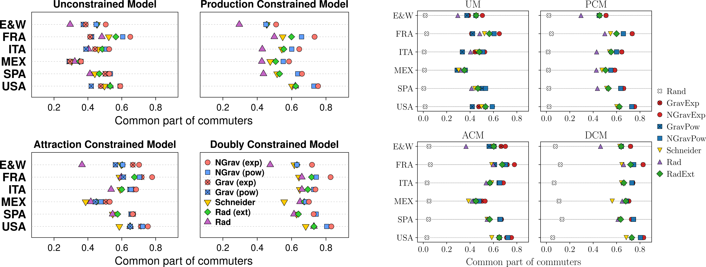

# Summary

Spatial interaction models provide a quantitative description of how individuals, goods, or information move between locations. In transportation research and urban geography, these models are used to estimate **trip distribution**, the step of the classical four-stage transport modelling framework that allocates trip origins to trip destinations through an Origin–Destination (OD) matrix [@Lenormand2016; @Barbosa2018]. A variety of laws—such as gravity-type decay functions or intervening-opportunities mechanisms—and several modelling strategies have been proposed, but rigorous comparison is challenging when law and model components are tightly coupled.

The *TDLM* framework was originally introduced to enable fair comparisons of trip distribution laws and models through a two-step procedure separating (i) the probability law governing the interaction process and (ii) the constrained model generating OD flows from that law. An implementation in R was published to facilitate adoption of this methodology.

Built on NumPy and SciPy, **PyTDLM** provides a full, native Python implementation of this framework, complementing the original Java-backed R codebase and extending its capabilities. In addition to porting the core methodology, the package offers vectorized algorithms, parallel execution, and introduces new functionality that simplifies calibration workflows and improves computational performance, making the framework accessible to researchers working within the Python scientific ecosystem.

# Statement of need

Most trip distribution models combine two distinct mechanisms: a *law* that specifies how interaction probability decreases or increases with distance or opportunities, and a *model* that constrains flows according to marginal totals. When these components are not explicitly separated, comparisons between gravity-based and intervening-opportunities-based approaches can lead to misleading conclusions [@Lenormand2012; @Simini2012; @Masucci2013; @Yang2014]. 

Several R packages offer implementations of spatial interaction models, including **gravity** [@Wolwer2018], **spflow** [@Dargel2021], **mobility** [@Giles2021], and **simodels** [@Lovelace2023]. While valuable, these tools either integrate the law and model components in ways that hinder systematic comparison, or they do not provide built-in evaluation tools for contrasting observed and simulated OD matrices. The TDLM methodology addresses these limitations by making the decomposition of mechanisms explicit.

The **PyTDLM** package responds to the need for a Python-native implementation that both reproduces the TDLM methodology and expands it to support high-performance computation and simplified calibration, while enabling integration with libraries such as NumPy, SciPy, Pandas, and Matplotlib.

# Functionality

**PyTDLM** is available on [PyPI](https://pypi.org/project/pytdlm), [conda-forge](https://anaconda.org/conda-forge/pytdlm) and 
[GitHub](https://github.com/RTDLM/PyTDLM). Documentation and a [tutorial](https://rtdlm.github.io/PyTDLM/tutorial/) using United States commuting data are available on the package website.

The package creates a pipeline for generating and validating OD matrices:

* **`run_law_model_gof`**
  A new high-level function introduced in the Python version, designed for efficiency. It computes mobility flows and goodness-of-fit metrics in a single stepBy computing goodness-of-fit metrics on the fly without persisting intermediate simulated matrices, it significantly reduces memory overhead compared to the traditional stepwise approach. When several exponents are provided, computations are automatically dispatched to multiple threads.

* **`run_optimization`** 
  A major addition to the Python port, this function automates parameter calibration. This function wraps `scipy.optimize.minimize_scalar` to determine the exponent that best maximizes or minimizes a selected goodness-of-fit measure. When multiple realizations are required, the function parallelizes the computation of realizations and passes averaged metrics to the optimizer.

* **Core Components (`run_law`, `run_model`, `run_law_model`)**: These functions provide granular access to the two-step generation process and now also supports multi-exponent parallelization:
    * `run_law`: Computes probability matrices based on spatial distribution laws (four variations of Gravity, three Intervening Opportunities, and Uniform).
    * `run_model`: Converts probabilities into flow counts using constrained modeling approaches (Unconstrained, Production/Attraction Constrained, Doubly Constrained).
    * `run_law_model`: A convenience wrapper executing both steps sequentially.

* **gof**
  Calculates six distinct goodness-of-fit measures to evaluate the accuracy of simulated matrices against observed data. Also supports multi-exponent parallelization.

Performance considerations guided much of the design. While the R version relied on Java for computational efficiency, PyTDLM is written entirely in Python. To maintain competitive performance, the implementation makes extensive use of NumPy broadcasting, vectorization, and shared-memory multiprocessing. Parallel tasks are dispatched through `multiprocessing` pools, with data exchanged via `shared_memory` blocks, which mitigate the overhead associated with `spawn()`-based process creation on Windows and macOS and reduce copy-on-write penalties on Linux.

# Benchmarks

**Validation**
To validate the Python implementation, we performed a systematic comparison against the original [Java implementation](https://github.com/maximelenormand/Trip-distribution-laws-and-models). We reproduced some case studies presented in @Lenormand2016. Figure 1 (right) displays the PyTDLM results, while Figure 1 (left) shows the original results. Across several countries, laws, models, and goodness-of-fit metrics, the results were consistent between the two implementations.

**Performance**
We benchmarked the wall-clock execution time of both packages using the example based on commuting data from Kansas in the United States in 2000. Tests were conducted on an Ubuntu 24.03.1 system equipped with an 18-thread CPU @4.6GHz and 64GB RAM. As shown in Figure 2, PyTDLM demonstrates competitive performance, benefiting from vectorization and effective parallelization strategies.

# Acknowledgements

This work was supported by the Institute of Computing and Data Sciences (Project ESTIMIA) and the French National Research Agency (Project MOSIS, ANR-24-CE38-5528).
The validation simulations were performed on the SACADO MeSU platform at Sorbonne Université.

# References

